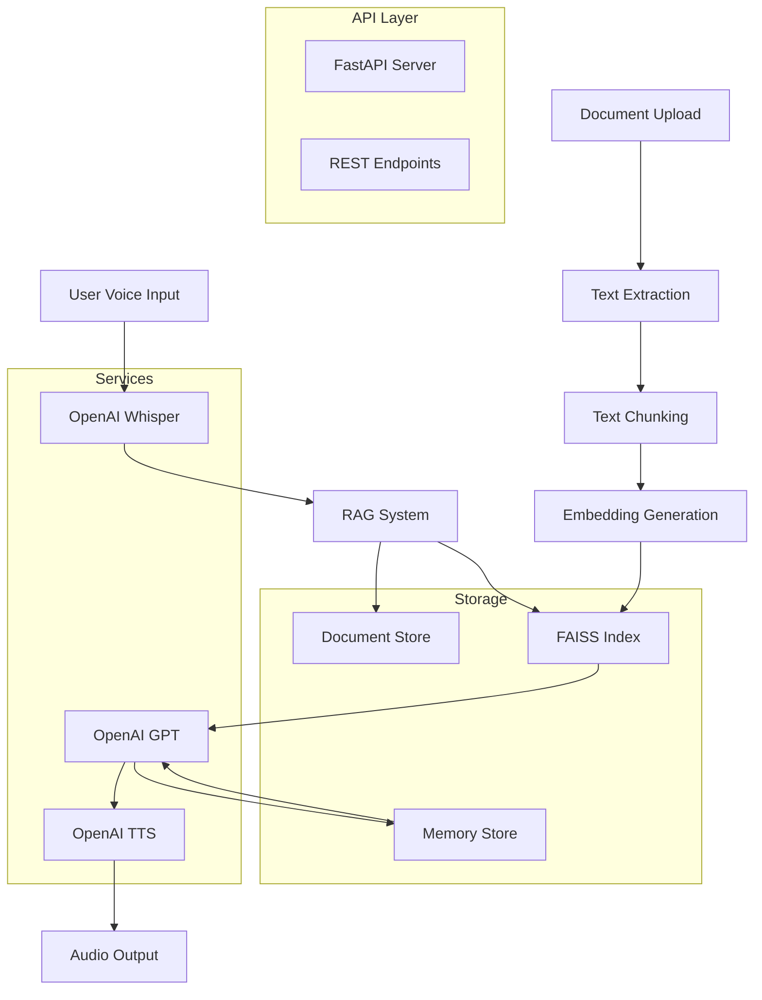

# Voice Conversational Agentic AI

A comprehensive Python-based RESTful API application that enables bi-directional voice conversations with Large Language Models (LLMs), enhanced with Retrieval Augmented Generation (RAG) using proprietary/internal documents.

## 🚀 Features

### Core Capabilities
- **Voice Input & Transcription**: Real-time voice capture and speech-to-text conversion
- **LLM Integration**: OpenAI GPT-powered conversations with context retention
- **RAG System**: Document upload, indexing, and retrieval for contextual responses
- **Text-to-Speech**: Convert AI responses to natural-sounding speech
- **Complete Pipeline**: End-to-end voice conversation with AI

### Advanced Features
- **Multi-format Document Support**: PDF, TXT, CSV, JSON, DOCX
- **Vector Search**: FAISS-powered semantic search for relevant context
- **Conversation Memory**: Persistent chat history during sessions
- **Audio Processing**: Real-time audio recording and playback
- **Performance Monitoring**: Detailed timing metrics for all operations
- **Health Monitoring**: System status and diagnostics endpoints

## 🏗️ Architecture



## 📋 API Endpoints

| Endpoint | Method | Description |
|----------|--------|-------------|
| `/transcribe` | POST | Convert audio to text |
| `/chat` | POST | Text-based conversation with LLM |
| `/speak` | POST | Convert text to speech |
| `/converse` | POST | Complete voice conversation pipeline |
| `/reset` | POST | Clear conversation memory |
| `/upload_rag_docs` | POST | Upload documents for RAG |
| `/health` | GET | System health check |
| `/conversation_history` | GET | Get current conversation history |
| `/clear_rag` | DELETE | Clear RAG knowledge base |

## 🛠️ Installation & Setup

### Prerequisites
- Python 3.8+
- pip package manager
- OpenAI API key
- Audio input/output devices

### Step 1: Clone the Repository
```bash
git clone https://github.com/yourusername/voice-conversational-ai.git
cd voice-conversational-ai
```

### Step 2: Create Virtual Environment
```bash
python -m venv venv
source venv/bin/activate  # On Windows: venv\Scripts\activate
```

### Step 3: Install Dependencies
```bash
pip install -r requirements.txt
```

### Step 4: Environment Configuration
```bash
cp .env.template .env
# Edit .env file with your API keys and configuration
```

### Step 5: Run the Application
```bash
python main.py
```

The API will be available at `http://localhost:8000`

## 🔧 Configuration

### Environment Variables

| Variable | Description | Default |
|----------|-------------|---------|
| `OPENAI_API_KEY` | OpenAI API key | Required |
| `APP_HOST` | Server host | 0.0.0.0 |
| `APP_PORT` | Server port | 8000 |
| `RAG_CHUNK_SIZE` | Document chunk size | 1000 |
| `RAG_TOP_K` | Number of relevant docs to retrieve | 3 |
| `DEFAULT_VOICE` | TTS voice | alloy |
| `DEFAULT_TEMPERATURE` | LLM temperature | 0.7 |
| `MAX_CONVERSATION_HISTORY` | Max conversation messages | 20 |

## 📖 API Usage Examples

### 1. Upload Documents for RAG
```bash
curl -X POST "http://localhost:8000/upload_rag_docs" \
  -F "files=@document1.pdf" \
  -F "files=@document2.txt"
```

### 2. Text-based Chat
```bash
curl -X POST "http://localhost:8000/chat" \
  -H "Content-Type: application/json" \
  -d '{
    "message": "What is the main topic of the uploaded documents?",
    "rag_context": "true"
  }'
```

### 3. Voice Transcription
```bash
curl -X POST "http://localhost:8000/transcribe" \
  -F "file=@recording.wav"
```

### 4. Text-to-Speech
```bash
curl -X POST "http://localhost:8000/speak" \
  -H "Content-Type: application/json" \
  -d '{
    "text": "Hello, this is a test of the text-to-speech system.",
    "voice": "alloy",
    "speed": 1.0
  }'
```

### 5. Complete Voice Conversation
```bash
curl -X POST "http://localhost:8000/converse" \
  -F "audio_file=@voice_input.wav" \
  -F "rag_context=true"
```

### 6. Reset Conversation
```bash
curl -X POST "http://localhost:8
